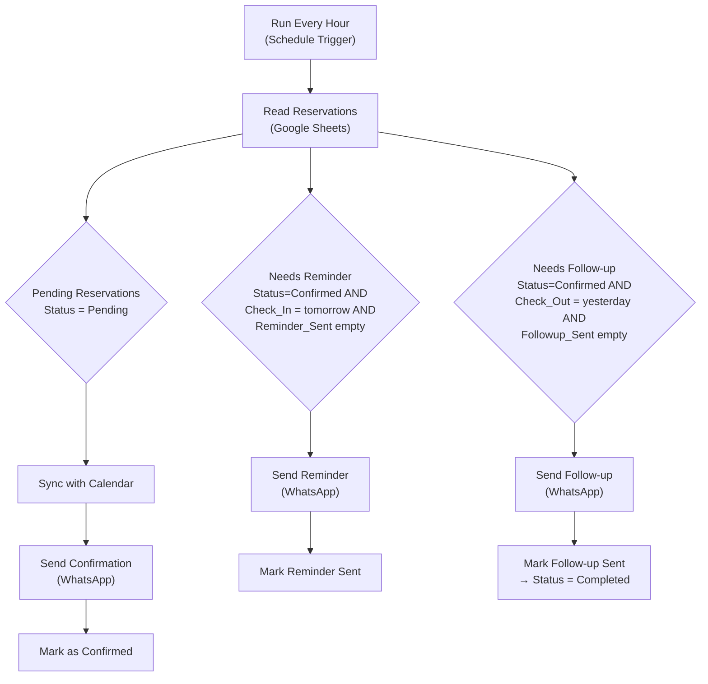

# Hotel Reservation Automation

An automated n8n workflow that syncs reservation events with downstream systems (Google
Calendar) and triggers confirmation, reminder, and follow-up message sequences over WhatsApp —
with **no manual intervention** required.

This is a companion workflow to
[Reception Automation](https://github.com/YonaidisSoto/Reception-Automation) (the conversational
AI receptionist): while that workflow *creates* reservations through a WhatsApp conversation,
this one owns the reservation's entire post-booking lifecycle.

---

## Table of Contents

- [Problem](#problem)
- [Solution](#solution)
- [Architecture](#architecture)
- [Tech Stack](#tech-stack)
- [Data Model](#data-model)
- [Design Notes](#design-notes)
- [Results](#results)
- [How to Replicate](#how-to-replicate)
- [Known Limitations / Next Steps](#known-limitations--next-steps)

---

## Problem

Once a reservation exists, a hotel still has three time-sensitive jobs to do for every single
booking: confirm it, remind the guest before arrival, and follow up after departure. Doing
this by hand for every reservation doesn't scale, is easy to forget under front-desk workload,
and reservation data (Sheets, Calendar) can silently drift out of sync if a step is missed.

## Solution

A single scheduled workflow that polls the reservations database every hour and deterministically
drives each reservation through its lifecycle:

- **Confirm & sync** — any reservation still `Pending` gets its Google Calendar event synced
  and a confirmation message sent, then flips to `Confirmed`.
- **Remind** — any `Confirmed` reservation checking in tomorrow gets a reminder message, sent
  exactly once.
- **Follow up** — any `Confirmed` reservation that checked out yesterday gets a thank-you +
  review-request message, then flips to `Completed`.

Because this logic lives outside the conversational agent, it runs reliably regardless of how
the reservation was created (via the WhatsApp AI agent, a manual entry, or a future booking
channel) — it only depends on the reservation's row in the spreadsheet, not on the agent
remembering every step.

## Architecture

The three branches run independently off the same hourly read — a reservation can be
mid-stay (confirmed, reminder already sent, follow-up not due yet) without any branch
interfering with another.

## Tech Stack

| Layer | Tool |
|---|---|
| Workflow orchestration | [n8n](https://n8n.io) |
| Reservation database | Google Sheets |
| Downstream sync target | Google Calendar |
| Guest messaging | [Evolution API](https://github.com/EvolutionAPI/evolution-api) (WhatsApp) |

## Data Model

Reads and writes the same **Reservations** sheet used by
[Reception Automation](https://github.com/YonaidisSoto/Reception-Automation):

| ID | Google_Event_ID | Guest_Name | Guest_Phone | Booking_Date | Check_In | Check_Out | Room_Type | Status | Notes | Created_At | Reminder_Sent | Followup_Sent |
|---|---|---|---|---|---|---|---|---|---|---|---|---|

`Reminder_Sent` and `Followup_Sent` are two boolean-style flag columns added specifically for
this workflow, so each message fires exactly once per reservation regardless of how many
times the hourly trigger runs during the eligible window.

`Status` moves through: `Pending` → `Confirmed` → `Completed` (or `Cancelled` /  `Modified`,
set independently by the receptionist agent).

## Design Notes

- **Date comparisons are string-based, not time-based.** `Check_In`/`Check_Out` are stored as
  plain `DD/MM/YYYY` dates with no time component, so "tomorrow" and "yesterday" are computed
  as formatted date strings (`$now.plus({days:1}).toFormat('dd/MM/yyyy')`) and compared with a
  simple string `equals` — no Luxon date-diff or timezone-sensitive arithmetic required. This
  keeps the filters trivially easy to read and immune to hour-of-day drift from the hourly
  poll.
- **Flags over disposable status values.** The reminder/follow-up "already sent" state
  couldn't reuse the `Status` field (that already encodes the booking lifecycle stage), so it
  gets its own dedicated column — the same pattern used by the appointment-booking workflow
  this project was originally adapted from.
- **Decoupled from the booking channel.** Because this workflow only reads the spreadsheet, it
  doesn't care whether a reservation was created by the AI WhatsApp agent, a staff member
  typing directly into the sheet, or a future integration (booking engine, PMS import) — any
  row with the right shape gets picked up.

## Results

This is a portfolio/case-study build demonstrating:

- A clean separation between the **conversational** booking flow (WhatsApp agent) and the
  **deterministic** lifecycle automation (this workflow) — each can be tested, debugged and
  extended independently.
- A guest-communication sequence (confirm → remind → follow up) implemented with plain
  spreadsheet-state polling instead of a bespoke scheduler or external CRM.
- Idempotent messaging: each stage's flag column guarantees a guest never receives the same
  confirmation, reminder, or follow-up twice.

## How to Replicate

### 1. Prerequisites

You need the same Google Sheet, Google Calendar, and Evolution API (WhatsApp) setup described
in [Reception Automation's replication guide](https://github.com/YonaidisSoto/Reception-Automation#how-to-replicate).
This workflow assumes that setup already exists and adds two columns to the **Reservations**
tab: `Reminder_Sent` and `Followup_Sent` (leave both empty for new rows).

### 2. Import the workflow into n8n

In n8n: **Workflows → Import from File** → select [`workflow.json`](workflow.json).

### 3. Configure credentials

The imported workflow has no credentials attached (they're never exported for security). You
need to create and attach:

| Node(s) | Credential type |
|---|---|
| Read Reservations, Mark as Confirmed, Mark Reminder Sent, Mark Follow-up Sent | Google Sheets OAuth2 |
| Sync with Calendar | Google Calendar OAuth2 |
| Send Confirmation, Send Reminder, Send Follow-up | Evolution API |

Replace `YOUR_GOOGLE_SHEET_ID` in every Google Sheets node with your real spreadsheet ID, and
`your-calendar-email@gmail.com` in the Calendar node with your real calendar.

### 4. Fill in the hotel's real information

Replace the `[HOTEL_NAME]` placeholders in the three message nodes (Send Confirmation, Send
Reminder, Send Follow-up) and the `[REVIEW_LINK]` placeholder in Send Follow-up with your
hotel's name and real review link (Google Business Profile, TripAdvisor, etc.).

### 5. Activate

Activate the workflow — it runs on its own schedule (every hour) with no trigger setup needed
on the Evolution API / webhook side, since it's schedule-driven rather than event-driven.

## Known Limitations / Next Steps

- Reminder/follow-up windows are computed once per hourly run using date-only comparisons; a
  reservation created or modified with a check-in/check-out date that's already "today" won't
  retroactively get a same-day reminder — this workflow is designed for a next-day reminder,
  not a same-day one.
- No error handling yet on the WhatsApp send or Sheets update steps — a production version
  should add retry logic and an alert path if a message fails to send.
- The Calendar sync step assumes the AI receptionist agent already created the event
  (`Google_Event_ID` populated) before the reservation reaches `Pending` — it updates an
  existing event rather than creating one from scratch.
